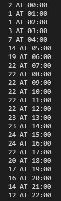

# SBSPS-Challenge-1029-AI-powered-Public-Transport-Management-System

# AI-powered-Public-Transport-Management-System

## Project ID  `#1029`

## Contributors
1. Mahij Momin
2. Mohit Gurav
3. Akashdeep Dhar
4. Ankit Sinha

## Problem Statement
- To create a system to monitor and generate report about active commuters in running buses at any point of time
- To make accurate estimates about probable timetable on the basis of previously occupied running time data
- To compensate for unforeseen changes in schedule eg. due to festival, national holidays or civil protests

## Prerequisite
- Machine Learning tools
    - Tensorflow
    - Keras
    - Pickle
- Statistical tools
    - Numpy
    - Pandas
    - Matplotlib

## Estimation models
- **Static model**  
  Uses time-tested mathematical models and long-duration history to generate time tables in a static order. Due to its conventional approach,
  it is suggested to be used in paths where route changes are less likely to occur. This is less agile to new changes but speedier due to rich
  availability of history.
- **Dynamic model**  
  Uses newly created mathematical models and short-duration history to generate time tables in a dynamic order. Due to its unconventional approach,
  it is suggested to be used in exemplary circumstances and in paths where route changes are highly likely to occur. This is more agile to new
  changes but less reliable.

## Executable elements
Dedicated function calls have been written for quicker and convenient accesses to
- Schedule for a given day
- Analyze special events with potential to affect planned schedule
- Predict static time table for transport mobiles
- Clean data (exclusive for dynamic model)
- Make normalization
- Predict time-series for bus quantity and time data
- Check dynamic model
- Convert normalized data into original scale
- Visualize the obtained results (with legends etc.)

# Proposed System

### Solution Description
*[NOTE: Camera part is yet to be implemented]*

Making use of the onboard vehicle cameras, crowds can be assessed and social distancing can be monitored. The feedback from the camera is then used by an AI model to decide the actual scheduling. 

* By minimizing inconvenience of the travelers based on such earlier record
* By automatically deciding action and path in case of emergency events
* By mitigating unforeseen circumstances - eg. large of number of travelers

An online platform further complements the AI where people can schedule their travel with minimal possible waiting time. The system is versatile and can be largely of utility even in the post-lockdown scenario by providing almost perfectly scheduled timings for the transport with optimal number of vehicles.

For Optimal number of vehicles, there are two modules which will help us in determining the number of buses needed to be scheduled. The first module will allocated/determine the number of bus for whole day in a Time wise manner depending upon the previous data, The second module which dynamic will help us in to increase or decrease the number of buses in real time depending on the crowd in buses. The Number of buses is been counted by the number of crowd and number of sitting capacity of a bus.

## Novelty/Uniqueness

1. AI based scheduling system to replace archaic static scheduling algorithms
1. Social distancing compliance and crowd monitoring with live camera feed
1. Self-adapting AI - learns from every travel to improve traveler experience
1. Online platform for booking schedule by regular travelers
1. Appropriate response to emergency events like protests and road blocks
1. Efficient enough to use existing hardware devices and active network

## Business/Social Impact

In order to mitigate infection by contact, all the norms of social distancing must be followed. Everyone across the world is biding their time to find a way to contain the spread of the COVID-19 infestation. The global economy is on the verge of one of the biggest recession in recent times due to containment. It is really important to set the economy to motion by providing safer and reliable transportation.

Work-from-home has been a welcome strategy for some business but to consider industries where this is not possible - people are about to lose jobs due to inactivity. In the wake of the COVID-19 pandemic, stepping out of houses and earning livelihood by hand becomes almost unavoidable to prevent people from losing the purchasing power. An economy can keep its cash flow running only when people can keep their jobs.

Not everyone can afford carpooling or travelling by personal vehicles. People have no choice but to turn to public transportation even when it might risk their lives due to social distancing being totally absent. A flexible scheduling system which learns from the historical data while constantly adapting to the growing needs of the people will be a revolution in public transport. The use of already installed onboard cameras can help efficiently monitor physical distancing and traveler count.

This idea has business potential for all the projects which are completed through the public-private partnership are most likely to be the early adopters of the system. The acquired capital can be used for further new improvements in the system and maintaining existing features. But at the paramount, the objective is to provide for efficient transportation all while evading the potential hazard of COVID-19 infestation due to unsatisfactory social distancing.

## Technology Stack

1. TensorFlow 2.0+ 
1. Python 3.7+
1. IBM Watson Studio
1. IBM Cloud 
1. IBM Db2
1. IBM Watson Visual Recognition
1. Flask

## Scope of work
1. To build the AI system described in the solution.
    * Determining the active traveling hours of the day.
    * Consulting previous travel records.
    * Processing camera feeds so as to include in decision making.
1. Camera feed processing to make sure social distancing is maintained.
1. The prototype of the online platform for displaying schedule
1. Notifying travelers about best-suited traveling options.

## Implementation in real life 

To use this solution in real we would need a database of every route and the number passenger in an hourly base, with the total capacity of the bus. With this data, our static module can predict the number bus to be deployed in the given hour by predicting the number of passengers for a route. By this, the bus depo/department can be prepared and can provide the optimal service where there will be less trouble for the passenger and less crowd in the bus. The prediction can help to schedule the timing of the bus which can be shared in an app or website where passengers can follow up for convince.    

Also, we would need a system to get the live count of the passengers on the bus. This will help our dynamic module to make changes in the number of buses if there is some random increase/decrease in the number of passengers. This will work on the data of the last 6 hours' strength of the passenger to determine if any changes are need or not.

**This System can be used also in local train scheduling** 

## Advantages 
* Our AI can predict the crowd and schedule things accordingly
* The Prediction help the passenger to know the availability of a bus
* Sudden Increase or Decrease of passenger, AI optimize the number of bus accordingly
* To have limited people in bus, which will help us to maintain the social distaining  
* This system can be used to schedule other public transportation like Local trains 
* It can help people to schedule their travels
* System help to optimize and avoid wasting resources  

# Results 

As discussed above there are two modules that are working together for optimal performance, 
### Static Module
The first module which is been called static module will determine the number of bus for a day depending on the previous data.

*Raw Feed of the graph is show below where number of bus is given for a given time*

 

### Dynamic Module
This module help us to adjust the number of buses in real time depending on the strength of passengers.

**Function**: to predict dynamic changes in static timetable

Inputs:

* Data of past 6 hours

Output:

* Crowd prediction for next 2 hours

