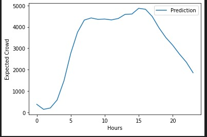
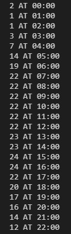
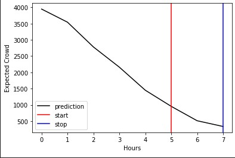

# AI-powered-Public-Transport-Management-System

## Project ID  `#1029`

## Contributors
1. Mahij Momin
2. Mohit Gurav
3. Akashdeep Dhar
4. Ankit Sinha

## Problem Statement
- To create a system to monitor and generate report about active commuters in running buses at any point of time
- To make accurate estimates about probable timetable on the basis of previously occupied running time data
- To compensate for unforseen changes in schedule eg. due to festival, national holidays or civil protests

## Prerequisite
- Machine Learning tools
    - Tensorflow
    - Keras
    - Pickle
- Statistical tools
    - Numpy
    - Pandas
    - Matplotlib

## Estimation models
- **Static model**  
  Uses time-tested mathematical models and long-duration history to generate time tables in a static order. Due to its conventional approach,
  it is suggested to be used in paths where route changes are less likely to occur. This is less agile to new changes but speedier due to rich
  availability of history.
- **Dynamic model**  
  Uses newly created mathematical models and short-duration history to generate time tables in a dynamic order. Due to its unconventional approach,
  it is suggested to be used in exemplary circumstances and in paths where route changes are highly likely to occur. This is more agile to new
  changes but less reliable.

## Executable elements
Dedicated function calls have been written for quicker and convenient accesses to
- Schedule for a given day
- Analyse special events with potential to affect planned schedule
- Predict static time table for transport mobiles
- Clean data (exclusive for dynamic model)
- Make normalization
- Predict time-series for bus quantity and timedata
- Check dynamic model
- Convert normalized data into original scale
- Visualize the obtained results (with legends etc.)

# Proposed System

### Solution Description
*[NOTE: Camera part is yet to be implemented]*

Making use of the onboard vehicle cameras, crowds can be assessed and social distancing can be monitored. The feedback from the camera is then used by an AI model to decide the actual scheduling. 

* By minimizing inconvenience of the travellers based on such earlier record
* By automatically deciding action and path in case of emergency events
* By mitigating unforeseen circumstances - eg. large of number of travellers

An online platform further complements the AI where people can schedule their travel with minimal possible waiting time. The system is versatile and can be largely of utility even in the post-lockdown scenario by providing almost perfectly scheduled timings for the transport with optimal number of vehicles.

For Optimal number of vehicles, there are two modules which will help us in determining the number of buses needed to be scheduled. The first module will allocated/determine the number of bus for whole day in a Time wise manner depending upon the previous data, The second module which dynamic will help us in to increase or decrease the number of buses in real time depending on the crowd in buses. The Number of buses is been counted by the number of crowd and number of sitting capacity of a bus.

# Results 

As discussed above there are two modules that are working together for optimal perfromance, 
### Static Module
The first module which is been called static module will determine the number of bus for a day depending on the previous data.

*Raw Feed of the graph is show below where number of bus is given for a given time*

 

### Dynamic Module
This module help us to adjust the number of buses in real time depending on the strenght of passengers.

**Function**: to predict dynamic changes in static timetable

Inputs:

* Data of past 6 hours

Output:

* Crowd prediction for next 2 hours

